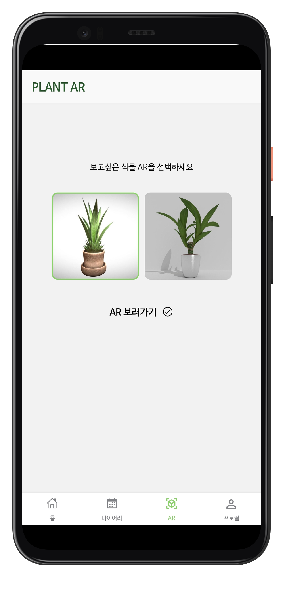

# GreenFingers

> 반려식물 종합관리 앱


## 📙GreenFingers소개

- 개발기간 : 2021.04.12 ~ 2021.05.21
- 앱 : GreeenFingers(그린핑거스)
  - 코로나19로 인해 사회에 대한 갈증이 더욱 더 커지면서 라이프스타일이 변화하고 있다. 집콕생활의 증가로 인한 우울감과 미래에 대한 불안감을 식물과 커뮤니케이션을 통해 극복하려는 사람이 자연스럽게 늘고 있다. 하지만 집에서 식물을 가꾸는 취미는 증가하고 있지만 식물에 대한 공부는 그에 미치지 못하고 있고, 식물을 키우기 위해서는 많은 정보와 노력이 필요하지만 그것이 쉽지 많은 않은 점에 착안하여 프로젝트를 기획
- 팀원 소개 : 


## 🔧Tech Stack


              


## 💻페이지소개

### Home Tab


#### Main Page

> 내가 가진 방 목록, 식물을 키우기 위한 날씨, 온도, 습도 정보를 확인할수 있고, 물주기 알림을 확인하는 버튼을 확인 할 수 있다.


#### Home Theme Edit Page

> 우측 상단의 설정 버튼을 클릭해 홈 이름과 테마 배경사진을 변경 할 수 있다.


#### Notification

> 우측 상단의 종모양 버튼을 클릭해 물주기 알림 목록을 확인하고, 자세한 알림 내용도 확인 할 수 있다.
>
> 알림은 식물 종류에 맞춰 자동으로 전송되며, 앱을 사용하지 않을때도 알림을 수신 받을 수 있다.


#### Room Page

> 메인화면의 방버튼을 클릭하면 그 방안에 존재하는 모든 식물의 리스트를 확인할 수 있다.


#### My Plant Detail

> 방 안의 식물을 클릭하면 나의 식물 정보(데려온 날짜, 적정온도, 적정습도, 물주기, 마지막 물 준 날짜)를 자세히 확인 할 수 있다.
>
> 다이어리 버튼을 눌러서 이 식물에 대한 일기와 물준 기록을 확인할 수 있다.
>
> 왼쪽 상단의 설정 버튼을 통해 식물 정보를 수정하거나, 죽은 식물 처리(떠나감), 식물을 삭제 할 수 있다.


> 떠나감 처리한 식물의 배경은 어둡게 처리 된다.


### Diary Tab

>다이어리 탭에서는 식물별로 물 주기, 일기를 작성, 수정, 삭제 할수 있고, 타임라인으로 전체 일기 기록을 한눈에 확인 할 수 있다.


#### Diary Main Calendar

> 다이어리 메인 페이지에서는 내가 가진 식물을  한 눈에 상단에서 확인 할 수 있고, 식물별로 물준날짜는 파란색 타원형으로 칠해지고, 일기를 쓴 날짜는 연두색 점이 찍힌다.


#### Diary Detail

> 연두색 점이 찍힌 날짜를 터치하면 그 날의 일기를 자세히 볼 수 있다.


#### Diary Timeline

> 식물의 성장 과정을 한 눈에 보기 쉽게 타임라인으로 확인 가능하다.


### AR Tab


#### 가상 식물 선택

>  가상으로 배치해볼 식물을 선택 할 수 있다.
>
> 현재는 두가지 식물 모델만 제공 하고 있다.



#### 가상 배치

> 손으로 드래그 해가며 가상으로 식물을 배치해 볼 수 있다.


### Profile Tab

> 유저의 개인정보를 변경, 수정, 삭제 할 수 있다.
>
> 현재 로그인된 유저의 메일과 보유 식물 정보를 확인 할 수 있다.
>
> 새로 키울 식물을 추천 받을 수 있다.
>
> 프로필 사진 변경, 비밀번호 변경, 탈퇴, 로그아웃을 할 수 있다.


#### 식물 추천


> GREEN-MBTI 테스트는 12문항으로 약 5분이 소요된다.


> 두 가지 선택지에서 한가지를 선택해 응답한다.  


> 설문을 마치면 나의 MBTI 유형과 그에 맞는 식물을 추천해 준다.


> 추천 받은 식물의 정보도 자세히 확인 할 수 있다. (키우기 난이도, 습도, 물주기 정보)


#### 프로필 사진 변경


#### 비밀번호 재설정

> 일반 이메일과 비밀번호 가입시에만 비밀번호가 변경가능하고, 소셜로그인을 통한 가입 사용자에게는 비밀번호를 변경할 수 없다 는 안내 메시지가 제공된다.


#### 회원탈퇴

> 회원탈퇴 전 개인정보 처리 및 재가입에 대한 안내 후 탈퇴가 진행된다.


### 회원가입

>이메일 가입, 구글 소셜 로그인을 제공


#### 로그인 페이지

> 로그인 하지 않은 유저의 경우 앱 이용시 가장 먼저 뜨는 화면
>
> 로그인, 회원가입, 비밀번호 재설정 기능이 제공된다.


#### 이메일 회원가입

> 이메일 회원가입 시에는 이메일 형식과 비밀번호 형식을 모두 충족해야 한다.


> 이메일은 이메일 형식을 지켜야 하며, 비밀번호는 대/소문자, 숫자, 특수문자를 모두포함한 8글자 이상의 조합이어야 한다.


#### 구글 소셜 회원가입


## 💎주요기능


### 방별 식물 관리 기능

> 실제 집 안에서 배치한 것처럼 앱에서도 방 별로 식물을 배치해 관리 하는 기능

- 메인화면 : 내가 가진 방 리스트를 확인할 수 있고, 메인화면 테마와 이름을 따로 지정해 편집가능
- 방 : 
  - 방안에 내가 가진 식물을 배치 할 수 있고, 방 테마와 이름을 지정해 편집가능
  - 방 안에 식물을 추가하거나 삭제하거나 떠나감 처리가 가능
  - 떠나간 식물의 경우, 일반 식물과 다르게 배경이 어둡게 처리 된다.
  - 방 안의 식물의 정보를 자세히 확인 할 수있고, 나의 식물 활동 기록 또한 확인 가능하다.

### AI를 통한 식물 등록

> 앱에 식물을 등록할 때, 사진 한장으로 간편하게 등록하는 기능

- 방에 식물을 등록할 때, 사진을 찍거나, 올려서 어떤 식물인지 판별할 수 있다.
- 판별된 결과로 식물을 등록하면, 그린핑거스의 DB에서 식물 정보가 자동으로 연동되어 식물을 키울 때 필요한 정보를 확인 할 수 있다.
- 또한, 연동된 식물 정보 중 급수주기와 사용자가 마지막으로 물 준 날짜를 파악해 물 주기 알림을 제공한다.


### 물 주기 알림

> 내가 따로 등록 하지 않아도 식물 별 물주기 알림을 통해 간편하게 식물을 케어하는 기능

- 등록된 식물의 급수주기와 사용자가 마지막으로 물 준 날짜를 파악해 알림을 제공한다.
- 로그인 되어 있을 경우, 앱을 사용하지 않을 때도 알림이 도착하고, 알림 확인시 앱으로 리다이렉트 된다.

- 메인화면의 종버튼을 통해 알림 기록을 확인 할 수 있다.


### AR 가상 식물 배치

> 3D 오브젝트를 통해 가상으로 집 안에 식물을 배치해 보는 기능

- 그린핑거스가 제공하는 3D오브젝트를 선택해 가상으로 배치해 볼수 있다. 현재 두가지 모델만 제공하고 있다.
- 오브젝트를 선택했다면 카메라를 이용해 원하는 위치를 촬영하고, 화면에 드래그 해가면서 식물을 가상으로 배치해 볼수 있다.


### GREEN-MBTI 식물 추천

> 그린핑거스가 만든 MBTI별 식물 추천 기능

- 그린핑거스가 만든 MBTI 판별 기능으로 12가지 문항에 응답함으로써 MBTI를 테스트 할 수 있다.
- MBTI별 어울리는 식물을 추천하고, 식물별 키우기 난이도 및 정보를 제공해 새로운 식물을 키우는 것을 장려한다.


##  ⚙️설치 및 실행

### Front End

- `.env`파일을 client 파일 내에 추가합니다. 
- Firebase 안드로이드 앱을 만든 후 제공되는 정보를 아래 폼에 입력합니다.

```
WEB_CLIENT_ID=
API_KEY=
AUTH_DOMAIN=
DATABASE_URL=
PROEJCT_ID=
STORAGE_BUCKET=
MESSAGING_SENDER_ID=
APP_ID=
MEASUREMENT_ID=
```

- Firebase에서 제공하는 google-services.json 파일을 client/android/app 폴더 안에 추가합니다.

- client 폴더에서 패키지를 설치합니다.

```
npm install
```

- 안드로이드 스튜디오에서 안드로이드 기기를 연결해 실행합니다. (React-Viro 라이브러리가 에뮬레이터를 지원하지 않습니다.)

- 프로젝트를 실행합니다.

```
npm run android
```


### Back End

인텔리제이를 이용하여 spring 프로젝트를 실행시킵니다.


### AI

- identify 폴더 안으로 들어옵니다. (학습된 모델 파일이 있어야 실행가능 하나 용량 문제로 Git에는 올리지 못했습니다.)

- 관련 라이브러리를 설치합니다.

```
pip install flask
pip install torch 
pip install torchvision 
pip install pillow 
pip install collections
```

- 모델을 실행합니다.

```
python3 app.py
```


